<div align="center"> 
AI 기반 용접 로봇 관제 및 유지보수 시스템 <br>

# 산업 현장에서 즉시 활용 가능한 AI 기반 용접 로봇 관제 시스템

</div>

# 1. 팀 소개

<table width="100%">
  <colgroup>
    <col width="20%" />
    <col width="20%" />
    <col width="20%" />
    <col width="20%" />
    <col width="20%" />
  </colgroup>
  <tbody>
    <tr>
      <td width="20%" align="center"></td>
      <td width="20%" align="center"></td>
      <td width="20%" align="center"></td>
      <td width="20%" align="center"></td>
      <td width="20%" align="center"></td>
    </tr>
    <tr>
      <td width="20%"><strong>송주엽(PM / FE 1)</strong></td>
      <td width="20%"><strong>김도영 (Infra & DB)</strong></td>
      <td width="20%"><strong>김민정(BE & Logic)</strong></td>
      <td width="20%"><strong>신승훈(AI & RAG)</strong></td>
      <td width="20%"><strong>정희영(FE 2)</strong></td>
    </tr>
    <tr>
      <td width="20%">PM, <code>Worker UI</code> 핵심 화면 구현, 공통 유틸리티 수립</td>
      <td width="20%"><code>Worker UI</code>Fastapi 기반 Rest API 설계, DB 구축, AWS 클라우드 인프라 구축 및 운영</td>
      <td width="20%"><code>Django</code> 서버 개발, 비즈니스 데이터 모델링(ORM), Admin용 CRUD API 구현</td>
      <td width="20%"><code>LangChain</code> 기반 AI 워크플로우 설계, <code>bge-reranker</code> 적용 및 검색 품질 고도화, 전처리 파이프라인</td>
      <td width="20%"><code>Admin UI</code> 관리자 관제 센터 구축, 데이터 시각화, 실시간 모니터링 UI 구현</td>
    </tr>
    <tr>
      <td width="20%" align="center"><a href="https://github.com/JUYEOP024"></a></td>
      <td width="20%" align="center"><a href="https://github.com/rubyheartsping"></a></td>
      <td width="20%" align="center"><a href="https://github.com/minjeong-kim-dev"></a></td>
      <td width="20%" align="center"><a href="https://github.com/seunghun92-lab"></a></td>
      <td width="20%" align="center"><a href="https://github.com/JUNGHEEYOUNG9090"></a></td>
    </tr>
  </tbody>
</table>

---

# 2. 프로젝트 개요 (Project Overview)

<div align="center">
  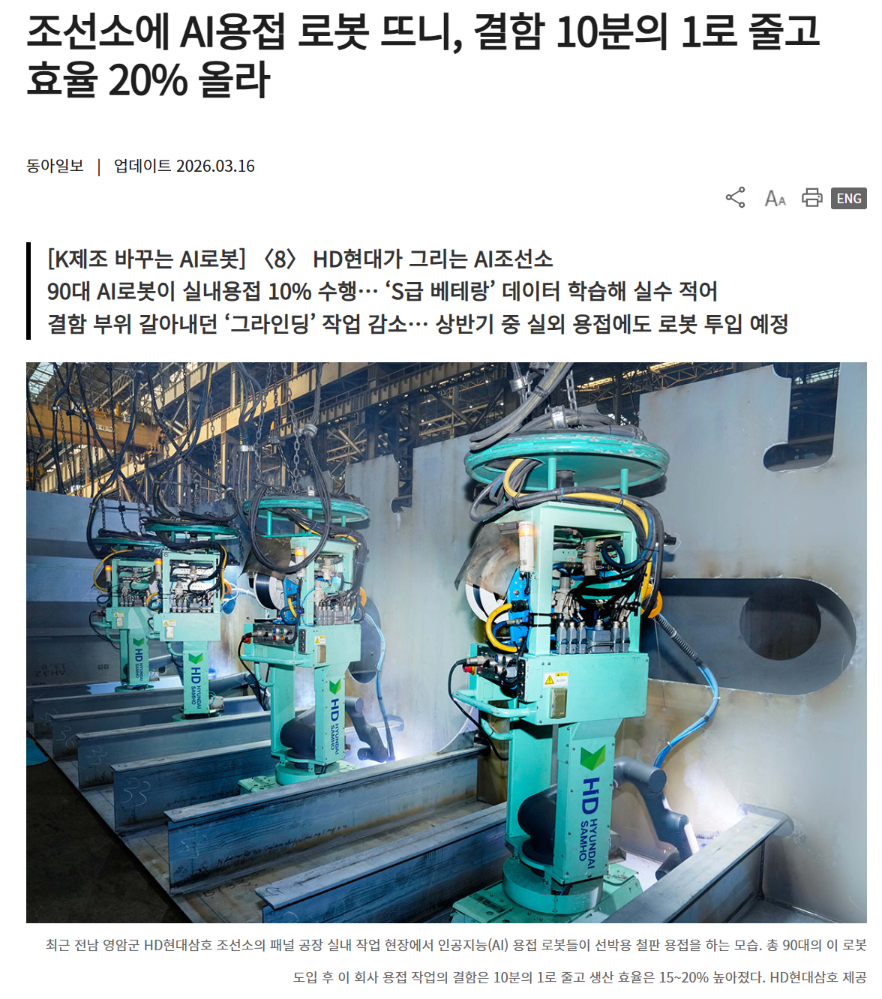
</div>
<br>

> 조선소에 AI용접 로봇 뜨니, 결함 10분의 1로 줄고 효율 20% 올라

본 프로젝트는 산업 현장에서 발생하는 **설비 운영 비효율, 숙련 인력 의존 문제, 실시간 대응 한계**를 해결하기 위한 AI 기반 기술 지원 시스템이다.

최근 제조 산업은 단순 자동화를 넘어 **AI 기반 자율 판단 시스템**으로 빠르게 전환되고 있으며, 작업자의 개입을 최소화하고 공정 전체를 자동화하려는 방향으로 발전하고 있다.

이러한 산업 변화는 기존의 매뉴얼 기반 대응 방식이 더 이상 효율적이지 않음을 의미하며,
현장에서는 **즉각적인 판단과 실행을 지원하는 AI 시스템의 필요성이 증가하고 있다.**

---

## 2.1 프로젝트 배경 : 왜 WELD-BOT이 필요한가?

### 1. 인력 구조의 변화 : "매뉴얼은 있지만 읽을 사람이 없다"

`한국 조선소의 외국인 비중은 이미 “전체 조선소 인력의 약 25%가 외국인”`  
`2024년 말 기준 빅3 조선소에서는 약 18%가 외국인`

최근 통계에 따르면 국내 주요 조선소 현장에서 외국인 근로자 비율은 이미 전체 인력의 20%를 넘어섰으며, 일부 지역에서는 4명 중 1명이 외국인일 정도로 빠르게 증가하고 있다.

`1만4000여 명 확보했지만 숙련공 부족 여전`  
`2027년까지 약 3만 6,000명 인력 부족 예상`

숙련공의 은퇴와 이탈로 인해 핵심 공정에서 대규모 인력 공백이 발생하고 있으며, 이를 외국인 및 신규 인력이 대체하면서 전체 숙련도는 낮아지는 추세다.

현장에서는 한국어에 익숙하지 않은 외국인 근로자가 급증하면서, 수십 페이지에 달하는 복잡한 작업 매뉴얼이 있어도 대부분 읽지 못하고, 옆 사람을 따라 하거나 감으로 작업하는 경우가 많다.

---

### 2. 열악한 작업 환경 : "시끄럽고, 장갑을 낀 상태에서는 검색조차 어렵다"

실제 산업 현장은 사무실과 다르다.

- 높은 소음 → 음성 인식(STT) 사용 어려움
- 보호 장비 착용 → 키보드 및 정밀 입력 불가
- 언어 다양성 → 한국어 매뉴얼 이해 어려움

---

### 3. 장애 대응 구조의 비효율 : "전문가를 기다리는 시간 = 비용"

현재 산업 현장에서 장비 에러가 발생하면 다음과 같은 구조로 대응된다.

작업자 → 관리자 → 외부 전문가

이 과정에서 다음 문제가 발생한다.

- 설비 가동 중단(Downtime, 장비가 멈춰 생산이 중단되는 시간)으로 인한 생산 손실
- 단순 문제에도 전문가를 호출해야 하는 구조로 유지보수 비용 증가
- 작업자가 임의로 조작할 경우 더 큰 고장이나 사고로 이어질 위험

---

### 4. 휴먼 에러와 전문가 의존 : "작은 실수가 라인 전체를 멈춘다"

휴먼 에러(Human Error)란 작업자의 판단 오류나 조작 실수를 의미한다.

기존 구조에서는 에러 발생 시 매뉴얼을 참고하거나 전문가를 호출해야 하며,  
이 과정에서 시간 지연과 비용 증가가 발생한다.

또한 작업자가 임의로 조작할 경우, 단순 고장이 전체 생산 라인 중단이나 산업 재해로 이어질 수 있다.

→ 문제의 핵심은 “매뉴얼이 없는 것”이 아니라 **“현장에서 바로 실행할 수 있는 가이드가 없다는 것”이다.**

---

## 2.2 핵심 목표 : 무엇을 해결하는가

WELD-BOT은 **현장 작업자의 실행 가이드 부족 문제**를 해결한다.

- 에러 발생 시 **즉각적인 원인 분석 및 대응 가이드 제공**
- **O/X 및 단계별 체크리스트** 기반 직관적 안내
- 작업자의 판단 부담 감소 → **휴먼 에러 최소화**
- 설비 가동 중지 시간(Downtime) 최소화

# 3. 기술 스택 (Tech Stack)

| 분류                 | 기술 스택 배지 (Tech Stack Badges)                                                                                                                                                                                                                                                                                                                                                                                                                                                                                                                                                                                                         |
| :------------------- | :----------------------------------------------------------------------------------------------------------------------------------------------------------------------------------------------------------------------------------------------------------------------------------------------------------------------------------------------------------------------------------------------------------------------------------------------------------------------------------------------------------------------------------------------------------------------------------------------------------------------------------------- |
| **AI & LLM**         |                                                                                                                                                                                     |
| **Backend & API**    |                                                                                                      |
| **Database & Infra** |                                                                                   |
| **Frontend & Tools** |       |

---

# 4. 아키텍처

## ERD

<!-- 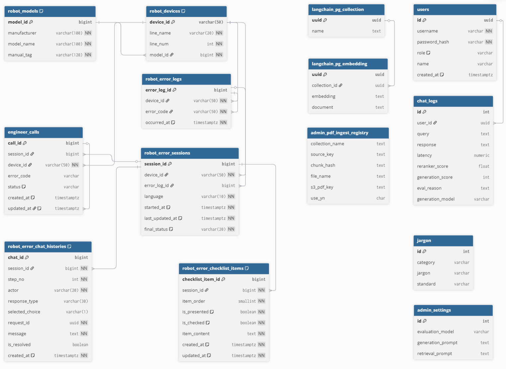 -->


<details>
<summary><b>도메인 설명</b></summary>

1. Robot Domain
   - robot_models → robot_devices → robot_error_logs
   - 로봇 모델, 장비, 에러 발생 이력을 계층적으로 관리

2. Interaction Domain
   - robot_error_sessions → chat_histories, checklist_items
   - AI 상담을 세션 단위로 관리
   - 채팅(O/X 선택) + 체크리스트 기반 단계별 장애 대응

3. User Domain
   - engineer_calls
   - 엔지니어 호출(에스컬레이션) 이력 관리

4. Admin & AI Domain
   - RAG 품질 평가, 프롬프트 관리, 문서(Vector DB) 관리
   </details>

## 시스템 아키텍처(System Architecture)

WELD-BOT은 **Frontend - Backend - AI Engine - DB**로 구성된  
멀티 모듈 구조로 설계되었습니다.

<!-- 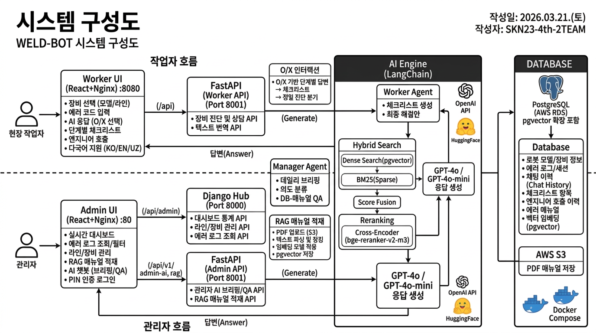 -->


> **프록시 라우팅 규칙**
>
> - **Admin UI**: 대시보드/통계/로그 요청은 Django Hub로, AI 브리핑/RAG 관리 요청은 FastAPI Worker로 프록시
> - **Worker UI**: 모든 `/api` 요청이 FastAPI Worker로 프록시
> - **개발 환경**: Vite dev-server proxy (`vite.config.docker.js`)
> - **운영 환경**: Nginx reverse proxy (`nginx/frontend_admin.conf`, `nginx/frontend_worker.conf`)

| 구성요소          | 역할                                             | 주요 기술                      | 개발 포트 | 운영 포트 |
| ----------------- | ------------------------------------------------ | ------------------------------ | --------- | --------- |
| Frontend (Admin)  | 관리자 대시보드 UI                               | React, Recharts/Chart.js, Vite | 5173      | 80        |
| Frontend (Worker) | 작업자 인터페이스                                | React, TypeScript, Vite        | 5174      | 8080      |
| Backend Hub       | 데이터 관리 및 통계 API                          | Django, DRF, PostgreSQL        | 8000      | 8000      |
| Worker API        | AI 요청 처리 및 스트리밍                         | FastAPI, Uvicorn               | 8001      | 8001      |
| AI Engine         | RAG 기반 분석 및 응답 생성                       | LangGraph, Reranker            | -         | -         |
| Data Pipeline     | 문서 임베딩 및 적재                              | PDFPlumber, pgvector           | -         | -         |
| SSH Tunnel(선택)  | 바스티온 EC2 경유 RDS 포트 포워딩(개발/특수환경) | sshtunnel, Paramiko            | 15432     | -         |

## Branch 구조

```
main
 └──develop
      ├── heartsping     # 김도영 작업 브랜치
      ├── kmj            # 김민정 작업 브랜치
      ├── sjy            # 송주엽 작업 브랜치
      ├── ssh            # 신승훈 작업 브랜치
      └── jhy            # 정희영 작업 브랜치
```

## AWS 배포 설계

### 개요

이 프로젝트는 AWS EC2 위에서 Docker Compose로 운영되며, 프런트엔드(관리자/작업자)와 백엔드(Django, FastAPI)를 동일 네트워크에서 연결합니다.

- 프런트엔드(정적): `frontend_admin`, `frontend_worker` (Nginx 기반 정적 서빙)
- 백엔드 API:
  - Django (`backend-hub`) : `/api/admin/...` 관리/통계/로그 API (프록시 별칭 `/api/v1/dashboard`, `/api/v1/logs` 포함)
  - FastAPI (`backend-worker-api`) : `/api/...` 작업자 상담/엔지니어 호출/AI 라우트
- 데이터베이스: AWS RDS PostgreSQL (`pgvector` 사용)
- 객체 저장소: AWS S3

---

### 아키텍처 다이어그램

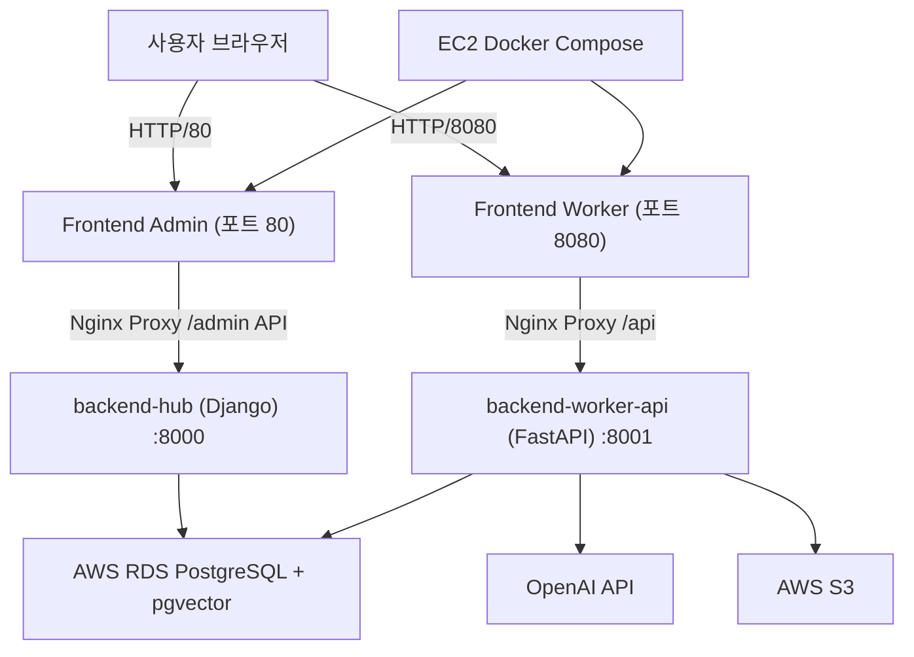

<details>
<summary><b>요청 경로 매핑</b></summary>

- 관리자 페이지
  - `80` 포트: `frontend-admin` 컨테이너가 페이지 제공
  - API 호출 예시: `/api/admin`, `/api/v1/dashboard`, `/api/v1/logs`, `/api/v1/admin-ai`, `/api/v1/rag`
  - 프록시 대상: `backend-hub`(Django, 8000) 또는 `backend-worker-api`(FastAPI, 8001)
- 작업자 페이지
  - `8080` 포트: `frontend-worker` 컨테이너가 페이지 제공
  - API 호출 예시: `/api/v1/consultations/*`, `/api/v1/consultations/stats`, `/api/v1/consultations/translate-text`
  - 프록시 대상: `backend-worker-api`(FastAPI, 8001)
- DB 연동
  - 두 백엔드 모두 `.env`의 PostgreSQL 설정으로 RDS 접속
- AI 처리
  - FastAPI Worker에서 OpenAI 호출 또는 자체 모델 모듈(`backend_ai`) 사용

</details>

<details>
<summary><b>배포 구성 요소</b></summary>
  
| 레이어 | 구성 | 역할 |
|---|---|---|
| 접속 계층 | EC2 보안그룹 | 포트(80, 8080, 22) 오픈 |
| 프런트엔드 계층 | `frontend-admin`, `frontend-worker` | 정적 번들 제공 + API 프록시 |
| API 계층 | `backend-hub`, `backend-worker-api` | Django 관리 API, FastAPI 작업자 API |
| 데이터 계층 | AWS RDS (PostgreSQL + pgvector) | 작업자/로그/세션/통계/벡터 데이터 |
| 저장소 계층 | AWS S3 | 첨부 파일/문서/파이프라인 산출물 |
| 외부 AI 계층 | OpenAI API | 번역/의사결정 모델 호출 |

</details>

<details>
<summary><b>운영 포인트</b></summary>

- 운영 기본 진입은 `docker-compose.prod.yml` 기준
- HTTPS 적용(권장): ALB 또는 Nginx reverse-proxy + 인증서 적용
- 데이터베이스 접속은 앱 시작 시 헬스체크/대기 로직으로 안정화
- 초기 기동 시 AI 로딩 지연을 고려해 컨테이너 재시작 정책과 healthcheck 간격 조정

</details>

---

## 폴더 및 파일 구조

```
SKN23-4th-2TEAM/
├── backend_ai/                         # AI/RAG 코어 엔진 모듈
│   ├── core/
│   │   ├── config.py                   # 환경 변수 로드, 모델/경로 설정
│   │   ├── manager_core.py             # 관리자 AI 브리핑 로직
│   │   ├── manager_planner.py          # 관리자 AI 플래너 로직
│   │   ├── manager_repository.py       # 관리자 AI 리포지토리 로직
│   │   ├── pipeline.py                 # 하이브리드 검색 파이프라인
│   │   ├── prompts.py                  # 프롬프트 정의
│   │   ├── reranker.py                 # Cross-Encoder 기반 Reranker Singleton
│   │   ├── retriever.py                # 하이브리드 검색(pgvector + BM25)
│   │   ├── worker_core.py              # 핵심 LLM 호출 로직
│   │   └── worker_agent.py             # LangGraph 상태 머신 에이전트 워크플로우
│   └── bm25_data/                      # BM25 Sparse Index 캐시 저장소
├── backend_hub/                        # Django 데이터 허브 및 통계 API (Port 8000)
│   ├── api/
│   │   ├── models.py                   # PostgreSQL ORM 모델 정의
│   │   ├── serializers.py              # Django 직렬화 로직
│   │   ├── shell_test.py               # Django 쉘 테스트
│   │   ├── views.py                    # 대시보드 통계 및 API 뷰 로직
│   │   └── urls.py                     # 허브 API 라우팅 엔드포인트
│   ├── config/
│   │   ├── urls.py                     # Django URL 설정
│   │   └── settings.py                 # Django 설정 (DB, CORS, 로깅)
│   └── manage.py                       # Django 엔트리 포인트
├── backend_worker_api/                 # FastAPI 작업자/AI 연동 서버 (Port 8001)
│   └── app/
│       ├── aws/
│       │   └── s3_client.py            # AWS S3 클라이언트
│       ├── routers/
│       │   ├── consultations.py        # 챗봇 상담 세션 및 SSE 스트리밍
│       │   ├── admin_ai.py             # 관리자 브리핑/Q&A API
│       │   └── rag_ingestion.py        # PDF 업로드 및 벡터 DB 적재
│       ├── services/                   # DB 상호작용 및 비즈니스 로직
│       │   ├── consultation_rules.py   # 상담 규칙 로직
│       │   └── rag_ingestion_service.py # RAG 적재 서비스 로직
│       ├── main.py                     # FastAPI 진입점, CORS, 라우터 등록
│       ├── db.py                       # psycopg2 DB 커넥션 관리
│       └── schemas.py                  # Pydantic 스키마 정의
├── data_pipeline/                      # 문서 전처리 및 벡터 적재 파이프라인
│   ├── shared/
│   │   └── pdf_parser.py               # PDF 파싱 유틸리티
│   ├── vector_db/
│   └── ingest.py                       # PDF → 청킹 → pgvector 적재
├── docker/                             # 인프라 및 컨테이너 설정
│   └── ssh-tunnel/                     # SSH 터널 사이드카 컨테이너
│       ├── Dockerfile
│       └── entrypoint.sh
├── frontend_admin/                     # 관리자 대시보드 서비스
│   ├── public/
│   └── src/
│       ├── assets/                     # 이미지, 폰트, 스타일 등 정적 리소스
│       ├── components/                 # KPI 카드, Chart, 네비게이션, 챗봇 UI
│       ├── layout/                     # 공통 레이아웃 구성
│       ├── lib/                        # 외부 라이브러리 설정
│       ├── mock/                       # 테스트용 목업 데이터
│       ├── pages/                      # 라우트별 페이지 컴포넌트
│       ├── services/                   # API 통신 로직
│       └── utils/                      # 공통 유틸리티 함수
├── frontend_worker/                    # 작업자 AI 가이드 (React + Vite + TypeScript)
│   ├── public/
│   ├── src/
│   │   ├── app/                        # 앱 전역 설정 및 상태 관리
│   │   ├── assets/                     # 정적 리소스
│   │   └── lib/                        # 라이브러리 설정
│   ├── vite.config.js                  # 로컬 Vite 설정
│   └── vite.config.docker.js           # Docker 환경 Vite 프록시 설정
├── nginx/                              # 운영 환경 Nginx 리버스 프록시 설정
│   ├── frontend_admin.conf             # Admin: Django + FastAPI 분기 프록시
│   └── frontend_worker.conf            # Worker: FastAPI 단일 프록시
├── docs/
│   └── DEPLOYMENT.md                   # Docker 배포 및 실행 상세 가이드
├── tests/                              # 테스트 및 데이터 검증 스크립트
├── 명세서/                               # ERD 및 API 규격 마크다운 문서
├── Dockerfile.backend                  # 백엔드 통합 이미지 (Django + FastAPI)
├── Dockerfile.frontend                 # 프론트엔드 멀티스테이지 (dev/prod)
├── docker-compose.yml                  # 개발 환경 오케스트레이션
├── docker-compose.prod.yml             # 운영 환경 오케스트레이션
├── .env                                # 환경 변수 (API 키, DB, SSH 등)
├── .env.docker                         # Docker 전용 환경 변수 오버라이드
├── run_tunnel.py                       # 로컬 SSH 터널 보조 스크립트
├── poetry.lock
├── pyproject.toml                      # Poetry 의존성 관리
└── run_all.sh / run_all.bat            # 비-Docker 통합 실행 스크립트
```

## RAG 파이프라인

```
작업자 입력 (에러 선택 / 질문)
    │
    ▼
[1] 입력 전처리 (Preprocessing)
    ├─ 작업자 입력 정규화
    └─ 불필요 토큰 및 노이즈 제거
    │
    ▼
[2] 임베딩 (Embedding)
    └─ OpenAI `text-embedding-3-small` → 벡터 변환
    │
    ▼
[3] 하이브리드 검색 (Hybrid Retrieval)
    ├─ Dense Search: pgvector (Semantic Similarity)
    └─ Sparse Search: BM25 (키워드 기반 검색)
    │
    ▼
[4] 재순위화 (Reranking)
    └─ Cross-Encoder (`bge-reranker-v2-m3`) 기반 정밀 재정렬
    │
    ▼
[5] 응답 생성 (LLM + Agent)
    ├─ LangGraph 기반 Multi-Agent 라우팅
    │   ├─ 상담 Agent
    │   ├─ 매뉴얼 검색 Agent
    │   └─ 관리자 분석 Agent
    └─ OpenAI GPT-4o 기반 응답 생성
    │
    ▼
[6] 프론트엔드 JSON 출력
```

---

# 5. 주요 기능 (Core Features)

## 5.1 현장 작업자용 AI 챗봇

### 1. 에러 코드 기반 정밀 진단

- 단순 FAQ가 아닌 장비 모델 + 에러 코드 기반 컨텍스트 매칭
- RAG 기반으로 해당 매뉴얼 구간을 추출하여 초기 대응 가이드 제공

### 2. O/X 기반 인터랙티브 문제 해결 흐름

- 각 단계마다 작업자가 수행 여부를 선택 (O / X)
- 선택 결과에 따라 다음 조치 or 추가 진단 분기

### 3. 단계별 대응 전략 제공

- overall → 전체 대응 방향 제시
- checklist → 실행 가능한 점검 항목 제공
- diagnosis → 추가 원인 분석 질문 진행

### 4. 다국어 지원

- 한국어(KO) / 영어(EN) / 우즈베키스탄(UZ)
- 동일 로직 기반으로 언어만 변환

### 5. 세션 복귀(Abandoned 세션 이어받기)

- 중단된 상담 세션을 조회하여 이어서 진행 가능
- 작업자가 현장을 이탈하거나 중단된 상황에서도 흐름 유지

### 6. 자동 세션 타임아웃 관리

- `ongoing` 상태의 세션이 30분 이상 비활성 상태일 경우 자동으로 `abandoned` 처리
- 불필요한 세션 누적 방지 및 상태 정합성 유지

### 기대 효과

- 장애 대응 시간 단축
- 비숙련 작업자도 숙련자 수준의 대응 가능
- 매뉴얼 검색 시간 단축

## 5.2 관리자용 분석 대시보드

### 1. 라인/장비별 장애 분석

- 에러 발생 빈도, 시간대별 패턴 시각화
- 장비별 고장 집중 구간 파악

### 2. AI 데일리 브리핑

- 하루 동안 발생한 에러 요약
- 주요 원인 Top-N 제공
- 매뉴얼 매칭 결과 리포트

### 3. 매뉴얼 자동 적재 파이프라인

- PDF 업로드 → Chunking → Embedding → Vector DB 저장 자동화

### 4. 엔지니어 호출 관리

- 작업자 해결 실패 시 호출 이력 추적

### 5. 관리자 AI 챗봇 (Admin QA)

- 화면 하단의 챗봇 버튼을 통해 언제든지 자유롭게 질문 가능
- "오늘의 주요 에러", "미해결 장애" 등 Quick Menu 지원

### 6. 로봇 모델 및 라인 관리

- 라인별 장비 카드 UI 제공
- 장비에 연결된 모델 변경 및 관리 기능 지원

### 7. 에러 로그 조회 및 필터링

- 라인 / 장비 / 에러코드 / 날짜 기준 필터링
- 로그를 페이지 단위로 나누어 빠르게 조회 가능

### 8. 관리자 AI 질의/브리핑 제어 (Admin Control)

- 관리자 챗봇에서 자연어 질의(`/admin-ai/ask`) 수행
- 브리핑 새로고침(`/admin-ai/briefing`)으로 최신 현황 반영

### 기대 효과

- 장애 패턴 기반 예방 정비 가능
- 엔지니어 호출 감소
- 데이터 기반 유지보수 계획 수립

---

# 6. 기능 시연

## 6.1 작업자 UI 메인 화면 (다국어)

<div align="center">
  <table>
    <tr>
      <td>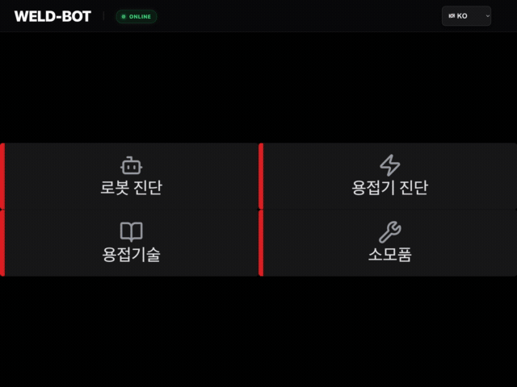</td>
      <td>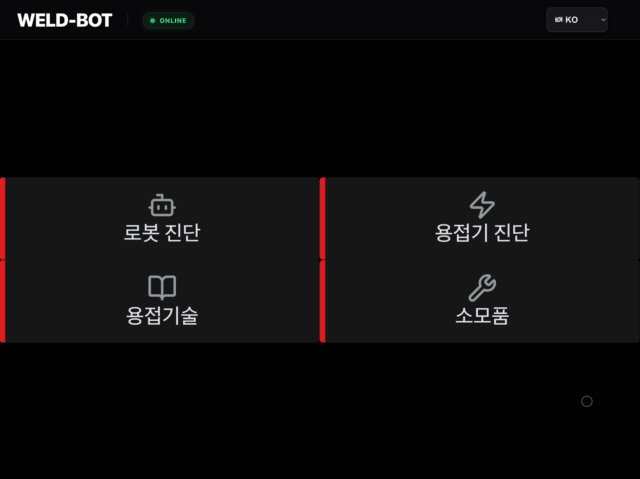</td>
    </tr>
    <tr>
      <td align="center"><b>KO 화면</b></td>
      <td align="center"><b>EN 화면</b></td>
    </tr>
  </table>
</div>

## 6.2 작업자 진단 플로우 핵심 기능

<div align="center">
  <table>
    <tr>
      <td>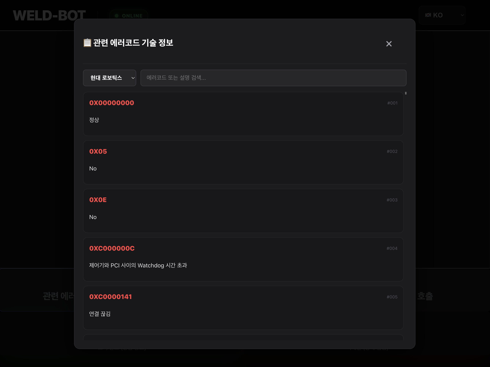</td>
      <td></td>
      <td></td>
    </tr>
    <tr>
      <td align="center"><b>관련 에러코드 조회</b></td>
      <td align="center"><b>장비 이력 조회</b></td>
      <td align="center"><b>엔지니어 호출</b></td>
    </tr>
  </table>
</div>

## 6.3 작업자 내장 관리자 패널

<div align="center">
  
</div>

## 6.4 RAG Ingestion 시연

<div align="center">
  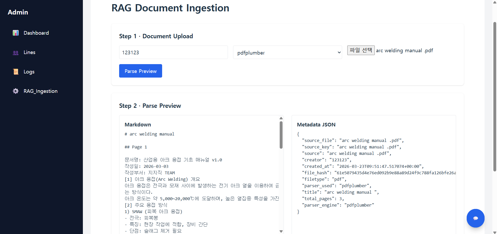
</div>

## 6.5 관리자 로그 조회 시연

<div align="center">
  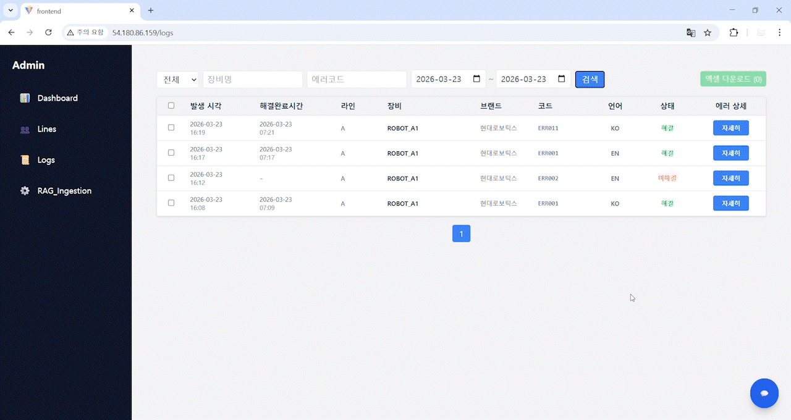
</div>

## 6.6 관리자 AI 챗봇 시연

<div align="center">
  
  <br>
  <b>챗봇 퀵 메뉴 시연</b>
  <br><br>
  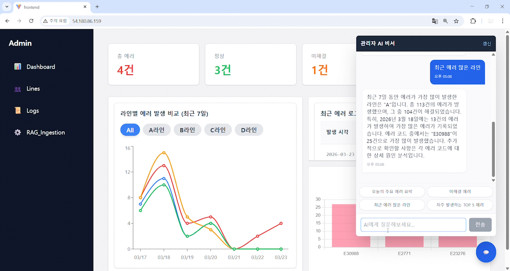
  <br>
  <b>챗봇 실제 대화 시연</b>
</div>

# 7. 테스트 계획 및 결과 보고서

LangSmith 기반으로 사용자 페이지와 관리자 페이지에 대한 시나리오 평가를 수행하였습니다.  
사용자 페이지는 에러코드 매뉴얼 검색 및 체크리스트 생성, 최종 종합 판단 품질을 중심으로, 관리자 페이지는 운영 데이터 질의응답 정확도와 의도 분류 일치 여부를 중심으로 성능을 측정하였습니다.

<details>
<summary><b>테스트 계획 및 결과 상세 보기 </b></summary>
<br>

### 7.1 테스트 계획

#### 7.1.1 테스트 목표

| 목표                          | 설명                                                        |
| ----------------------------- | ----------------------------------------------------------- |
| 사용자 페이지 응답 정확성     | 에러코드에 대해 올바른 매뉴얼/조치 정보를 반환하는지 확인   |
| 체크리스트 품질               | 점검 항목 누락, 중복, 빈 항목 없이 생성되는지 확인          |
| 관리자 페이지 질의응답 정확성 | 운영 현황 질문에 대해 적절한 답변을 생성하는지 확인         |
| 의도 분류 정확성              | 질문 의도에 맞는 태스크로 분기되는지 확인                   |
| 환각 억제                     | 근거 없는 정보 생성 없이 데이터 기반 답변을 유지하는지 확인 |

#### 7.1.2 테스트 유형

| 구분                        | 평가 건수 | 설명                                                       |
| --------------------------- | --------: | ---------------------------------------------------------- |
| 사용자 페이지(Worker Eval)  |     100건 | 에러코드 기반 매뉴얼 매칭, 체크리스트 생성, 환각 여부 평가 |
| 관리자 페이지(Manager Eval) |      50건 | 운영 데이터 기반 질의응답, 의도 분류, grounding 평가       |
| 합계                        |     150건 | LangSmith 자동 평가 결과 기준                              |

#### 7.1.3 평가 항목

| 항목               | 기준                                             |
| ------------------ | ------------------------------------------------ |
| 정답/매뉴얼 일치   | 기대 문서와 실제 응답이 일치하는지 여부          |
| 체크리스트 품질    | 점검 항목 수, 누락 여부, 중복 여부, 빈 항목 여부 |
| 의도 분류 일치     | 예상 태스크와 실제 분류 태스크의 일치 여부       |
| Grounding          | 운영 데이터/매뉴얼을 근거로 답변했는지 여부      |
| Hallucination 억제 | 근거 없는 정보를 생성하지 않았는지 여부          |
| 종합 점수          | LangSmith judge overall score 평균               |

---

### 7.2 테스트 데이터셋 상세

#### 7.2.1 사용자 페이지 데이터셋 상세 (100건)

| 항목                  | 건수 | 설명                                                        |
| --------------------- | ---: | ----------------------------------------------------------- |
| UR 로봇 에러코드      | 92건 | UR 계열 에러코드에 대한 매뉴얼 매칭 및 체크리스트 평가      |
| Hyundai 로봇 에러코드 |  8건 | Hyundai 계열 에러코드에 대한 매뉴얼 매칭 및 체크리스트 평가 |

#### 7.2.2 관리자 페이지 데이터셋 상세 (50건)

| 태스크 유형           | 건수 |
| --------------------- | ---: |
| `error_code_analysis` | 12건 |
| `error_count`         |  9건 |
| `error_list`          |  6건 |
| `line_risk`           |  5건 |
| `overview`            |  5건 |
| `unresolved_list`     |  4건 |
| `line_status`         |  4건 |
| `top_error`           |  3건 |
| `line_list`           |  2건 |

---

### 7.3 테스트 결과

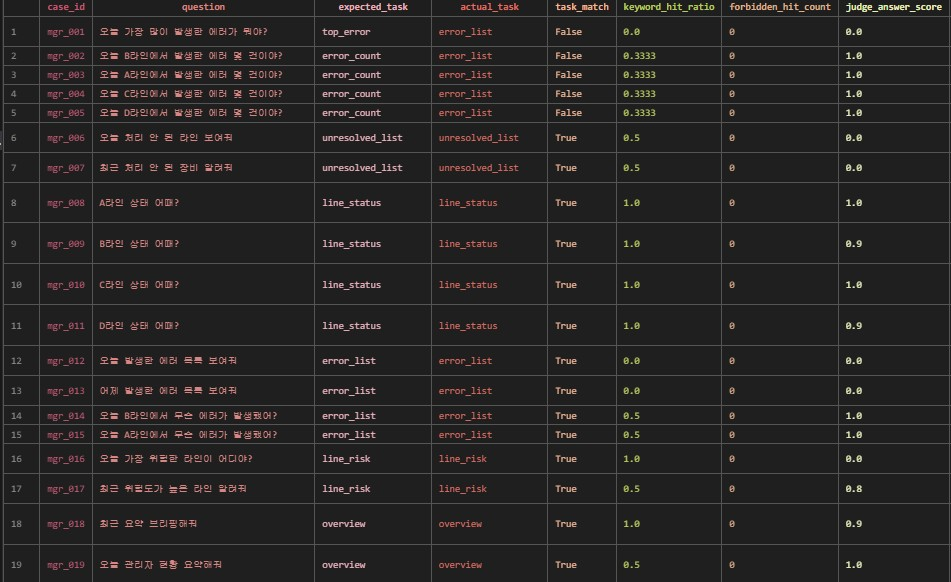

#### 7.3.1 사용자 페이지 정량 결과

| 항목                     |   수치 |
| ------------------------ | -----: |
| 총 평가 건수             |  100건 |
| 매뉴얼/응답 매칭 성공    |   99건 |
| 매칭 실패                |    1건 |
| 매뉴얼 일치율            |    99% |
| 평균 Retrieval Score     |  0.990 |
| 평균 Checklist Score     |  0.792 |
| 평균 Hallucination Score |  0.987 |
| 평균 Overall Score       |  0.919 |
| 평균 문서 검색 수        | 2.00건 |
| 평균 체크리스트 수       | 4.95개 |
| 체크리스트 중복 항목     |    0건 |
| 체크리스트 빈 항목       |    0건 |

#### 7.3.2 관리자 페이지 정량 결과

| 항목                     |  수치 |
| ------------------------ | ----: |
| 총 평가 건수             |  50건 |
| 정답 판정                |  34건 |
| 오답 판정                |  16건 |
| 정답률                   |   68% |
| 태스크 일치              |  39건 |
| 태스크 불일치            |  11건 |
| 태스크 일치율            |   78% |
| 평균 Answer Score        | 0.628 |
| 평균 Intent Score        | 0.796 |
| 평균 Grounding Score     | 0.668 |
| 평균 Hallucination Score | 0.916 |
| 평균 Overall Score       | 0.654 |
| 평균 Keyword Hit Ratio   | 0.573 |
| Forbidden Hit 누적       |   0건 |

#### 7.3.3 대표 실패 사례

| 페이지        | 케이스    | 관찰 내용                                                                         |
| ------------- | --------- | --------------------------------------------------------------------------------- |
| 사용자 페이지 | `0X05`    | 매뉴얼 정보가 없는 에러코드로 판단되어 체크리스트가 생성되지 않음                 |
| 관리자 페이지 | `mgr_001` | "오늘 가장 많이 발생한 에러" 질문을 `error_list` 성격으로 처리하여 핵심 답변 누락 |
| 관리자 페이지 | `mgr_012` | "오늘 발생한 에러 목록" 요청에서 에러 코드 및 라인명 정보가 충분히 제시되지 않음  |
| 관리자 페이지 | `mgr_021` | `E0502` 조치 방법 질문에서 원인 및 구체 조치 절차 안내 부족                       |
| 관리자 페이지 | `mgr_028` | 상위 5개 에러 요청을 목록 조회 수준으로 처리하여 Top-N 요약 실패                  |

---

### 7.4 시스템 통합 관점 요약

#### 7.4.1 최종 집계

| 구분          | 총 건수 | 핵심 성과                               | 보완 필요                                           |
| ------------- | ------: | --------------------------------------- | --------------------------------------------------- |
| 사용자 페이지 |     100 | 매뉴얼 매칭 99%, 환각 억제 우수         | 일부 조치 항목 누락, 미등록 에러 대응 보완 필요     |
| 관리자 페이지 |      50 | 환각 억제 안정적, 일부 카운트 질의 정확 | 태스크 분류, Top-N 응답, 미해결 현황 응답 개선 필요 |

#### 7.4.2 종합 결론

사용자 페이지는 매뉴얼 매칭과 체크리스트 구조 측면에서 전반적으로 안정적인 성능을 보였습니다. 반면 관리자 페이지는 환각 억제는 양호하지만, 질문 의도를 세밀하게 구분해야 하는 운영 질의에서 태스크 라우팅과 핵심 정보 추출 정확도를 추가로 보완할 필요가 있습니다.

</details>

---

# 8. WBS (Work Breakdown Structure)

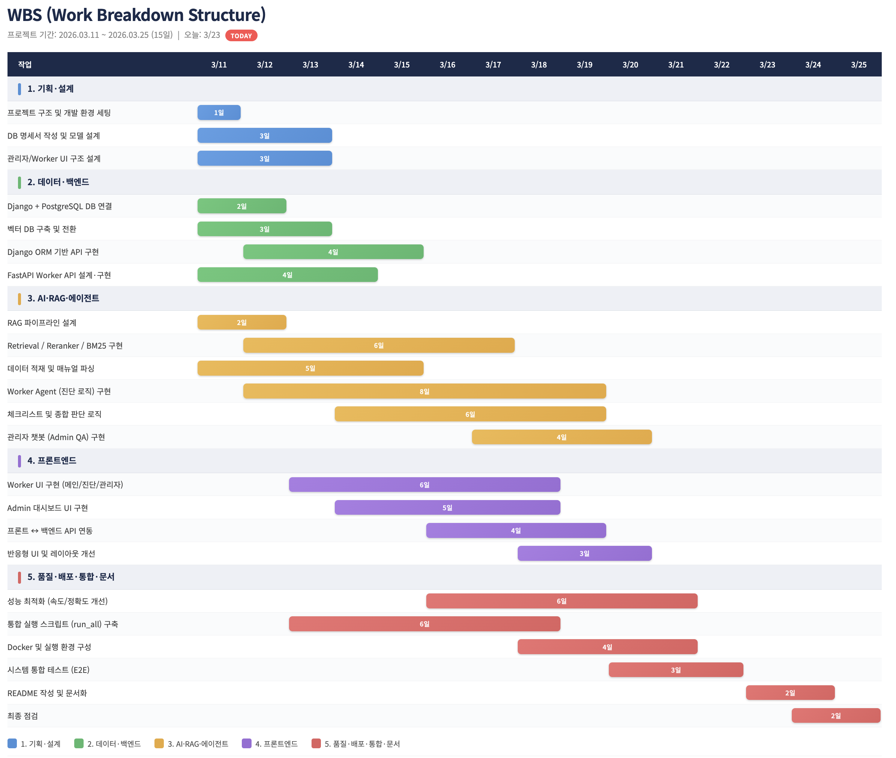

# 9. 트러블 슈팅

### 1. 화면 레이아웃 문제 (Lines / RAG Ingestion)

- **현상**: `Lines`, `RAG_Ingestion` 페이지가 뷰포트를 가득 채우지 못하고 오른쪽에 빈 영역이 생김.
- **원인**: `index.css`의 `body` 레이아웃·가로 스크롤 관련 설정.
- **해결**: `body`에 `overflow-x: hidden` 등을 적용해 가로 여백·스크롤로 인한 빈 공간을 제거.

```css
body {
  margin: 0;
  min-width: 320px;
  min-height: 100vh;
  overflow-x: hidden; /* 오른쪽 빈 공간 방지 */
}
```

### 2. 프로젝트 피벗(Pivot)에 따른 일정 압박 및 소통 병목

- **현상**: 텍스트 챗봇에서 `Touch UX 기반 상용 HMI`로 기획이 전면 수정되면서, 짧은 기간 안에 FE · BE(Django) · AI(FastAPI) 간 API 연동과 커뮤니케이션 병목이 발생.
- **해결**: 데일리 스크럼으로 파트별 진행을 투명하게 동기화하고, FE/BE가 병렬 작업할 수 있도록 **요청·응답 JSON 기반 API 스펙**을 최우선 확정하여 개발 속도 개선.

### 3. RAG 검색 정확도 저하 (관련 없는 매뉴얼 혼입)

- **현상**: 검색 시 관련 없는 매뉴얼까지 함께 조회되어 응답 품질이 떨어짐.
- **해결**: exact search, hybrid retrieval, reranking 단계를 분석·조정하고, 관련도가 높은 문서가 우선 반영되도록 검색 파이프라인을 개선.

### 4. 에러 목록 조회 지연

- **현상**: 에러 목록 조회 시 데이터 로드 지연으로 응답이 느려짐.
- **원인**: 에러 관련 테이블을 필터 없이 전체 스캔해 불필요한 데이터까지 응답에 포함하는 비효율.
- **해결**: `session_id` 기준으로 그룹화(Group By)하여 핵심 정보만 요약 조회하도록 쿼리·로직 변경.

# 10. 회고

<!-- Markdown 표는 2열 구분선 길이 비율 때문에 '이름' 열이 한 글자씩 세로로 쌓일 수 있어, HTML `<colgroup>`으로 첫 열 최소 너비를 고정 -->
<table>
  <colgroup>
    <col width="110" />
    <col />
  </colgroup>
  <thead>
    <tr>
      <th align="center" valign="top">이름</th>
      <th align="center" valign="top">회고</th>
    </tr>
  </thead>
  <tbody>
    <tr>
      <td valign="center">송주엽</td>
      <td valign="top">이번 프로젝트에서 PM과 FE 역할을 함께 맡아 일정 관리와 화면 구현을 병행했습니다. PM으로서 결과물의 완성도를 더 높였으면 좋았겠다는 아쉬움은 남지만, 팀원별 진행 상황을 맞추고 API 연동 시점을 조율하는 과정에서 끝까지 책임감을 갖고 최선을 다했습니다. 요구사항을 기능 단위로 나눠 우선순위를 정리하며 프로젝트를 안정적으로 마무리했고, 작업자 UI와 관리자 UI를 정리하면서 사용자 관점에서 "즉시 이해되는 흐름"의 중요성을 깊이 배웠습니다. 다음 프로젝트에서는 초기 설계 단계부터 화면 구조와 API 계약을 더 정교하게 맞춰 개발 효율과 품질을 함께 끌어올리고 싶습니다.</td>
    </tr>
    <tr>
      <td valign="center">김도영</td>
      <td valign="top">LLM 기반 서비스를 만드는 것뿐만 아니라 이를 실제로 사용가능한 형태로 빚어내는 프로젝트에 참여했습니다. 본 프로젝트에서 정보가 실제로 전달되고 저장될 수 있는 큰 틀을 구축하는 경험을 할 수 있었는데, 이를 통해 단순 LLM, AI의 활용만 있어서는 부족할 수 있음을 깨달았습니다. 한편 AWS 기반 인프라를 다룰 기회가 많았는데, 로컬 환경에서의 테스트와 배포 환경에서의 구동은 많은 차이가 있음을 알 수 있었습니다. 전반적으로 실무자 관점에서 일하게 되어 뜻깊은 프로젝트라 생각합니다.</td>
    </tr>
    <tr>
      <td valign="center">김민정</td>
      <td valign="top">Django를 맡게 되면서 수업 진도보다 먼저 프로젝트를 시작하게 되었고, 스스로 예습하며 구현해야 하는 도전적인 상황이었습니다.<br>처음 접하는 프레임워크를 실전 프로젝트에 적용하며 시행착오도 많았지만, 문제를 하나씩 해결해 나가며 결국 프로젝트를 마무리할 수 있었습니다.<br>비록 완성도 측면에서는 아쉬움이 남지만, Django의 전반적인 구조와 흐름을 직접 경험하며 이해할 수 있었고, 실무와 유사한 개발 과정을 겪어볼 수 있었다는 점에서 의미 있는 시간이었습니다.<br>이번 경험을 바탕으로 부족했던 부분을 보완하고 보다 안정적이고 완성도 높은 서비스를 구현할 수 있도록 노력할 것입니다.</td>
    </tr>
    <tr>
      <td valign="center">신승훈</td>
      <td valign="top">RAG 기반 AI 백엔드의 검색, 진단, 관리자 응답 흐름을 분석하며 서비스 전체 구조를 실무 관점에서 이해했습니다. 또한 RAG 서비스가 단순 검색이 아니라 검색 정확도·문맥 구성·최종 응답 품질이 함께 맞물려 동작한다는 점을 이해했습니다.</td>
    </tr>
    <tr>
      <td valign="center">정희영</td>
      <td valign="top">이번 프로젝트에서는 앞선 프로젝트와 달리 React를 이용한 관리자 페이지 프런트를 담당했습니다. 평소에는 주로 백엔드 작업을 수행해왔기에 프런트엔드는 익숙하지 않았지만, 이전에 React를 학습한 경험 덕분에 기본적인 구조와 컴포넌트 작성은 비교적 수월하게 진행할 수 있었습니다. API 연동 같은 부분에서 어려움을 느꼈지만, API 명세를 맞추고 컴포넌트 구조를 설계하는 과정에서 프런트엔드와 Django백엔드의 연결 방식을 체감하며 전체적인 개발 흐름을 이해할 수 있었습니다. AI 개발 경험은 직접 쌓지 못해 아쉽지만, 이번 경험을 통해 익숙하지 않은 분야에도 충분히 도전할 수 있다는 자신감을 얻었고, 앞으로 프런트와 백엔드를 모두 아우르며 AI 개발자로 성장할 수 있는 기반을 조금씩 넓혀갈 수 있겠다는 느낌을 받았습니다.</td>
    </tr>
  </tbody>
</table>
