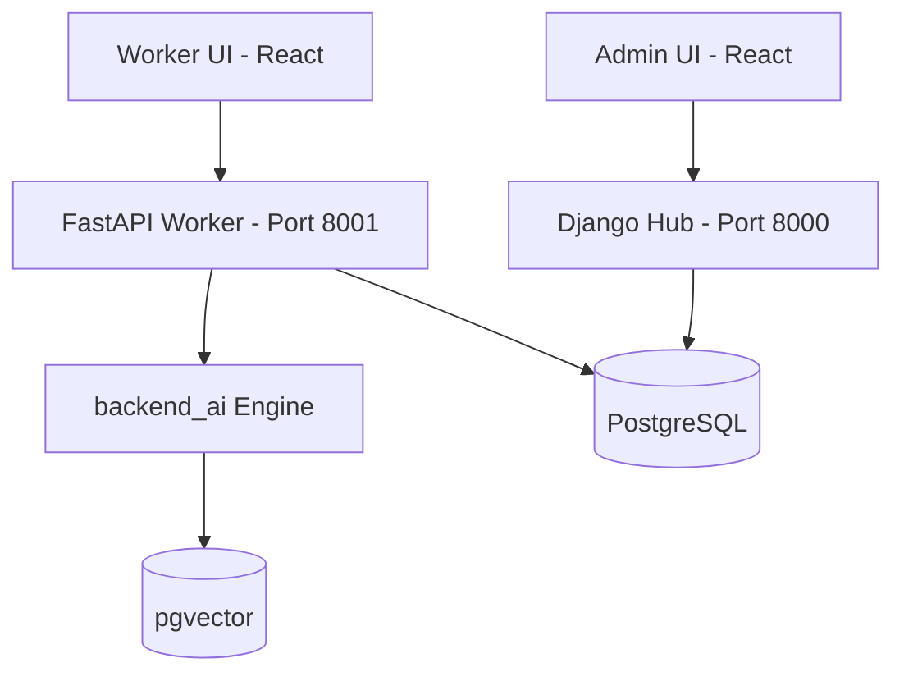

<div align="center"> 
AI 기반 용접 로봇 관제 및 유지보수 시스템 <br>

# 산업 현장에서 즉시 활용 가능한 AI 기반 용접 로봇 관제 시스템

------------------------------------------------------------------
</div>

# 1. 팀 소개
|  |  |  |  |  |
|----------------------|----------------------|----------------------|----------------------|----------------------|
| **송주엽(PM / FE 1)** | **김도영 (Infra & DB)** | **김민정(BE & Logic)** | **신승훈(AI & RAG)** | **정희영(FE 2)** |
| `frontend_worker` 개발, 전체 MSA 아키텍처 및 API 규격 설계, 공통 유틸리티 수립 |  `backend_ai` (FastAPI) 인프라 구축, PostgreSQL & Vector DB 연동, CORS 및 통신 보안 정책 수립 | `backend_hub` (Django) 서버 개발, 비즈니스 데이터 모델링(ORM), 통계 및 어드민용 CRUD API 구현 | `LangGraph` 기반 AI 워크플로우 설계, `bge-reranker` 적용 및 검색 품질 고도화, 전처리 파이프라인 | `frontend_admin` (React) 관리자 관제 센터 구축, 데이터 시각화(Chart.js), 실시간 모니터링 UI 구현 |
| [](https://github.com/JUYEOP024) | [](https://github.com/rubyheartsping) | [](https://github.com/minjeong-kim-dev) | [](https://github.com/seunghun92-lab) | [](https://github.com/JUNGHEEYOUNG9090) |
---

# 2. 프로젝트 개요 (Project Overview)
<div align="center">
  
</div>
<br>

> 조선소에 AI용접 로봇 뜨니, 결함 10분의 1로 줄고 효율 20% 올라

본 프로젝트는 산업 현장에서 발생하는 **설비 운영 비효율, 숙련 인력 의존 문제, 실시간 대응 한계**를 해결하기 위한 AI 기반 기술 지원 시스템이다.

최근 제조 산업은 단순 자동화를 넘어 **AI 기반 자율 판단 시스템**으로 빠르게 전환되고 있으며, 작업자의 개입을 최소화하고 공정 전체를 자동화하려는 방향으로 발전하고 있다.

이러한 산업 변화는 기존의 매뉴얼 기반 대응 방식이 더 이상 효율적이지 않음을 의미하며, 
현장에서는 **즉각적인 판단과 실행을 지원하는 AI 시스템의 필요성이 증가하고 있다.**

---

## 2.1 프로젝트 배경 : 왜 WELD-BOT이 필요한가?

### 1. 인력 구조의 변화 : "매뉴얼은 있지만 읽을 사람이 없다"

`한국 조선소의 외국인 비중은 이미 “전체 조선소 인력의 약 25%가 외국인”`  
`2024년 말 기준 빅3 조선소에서는 약 18%가 외국인`

최근 통계에 따르면 국내 주요 조선소 현장에서 외국인 근로자 비율은 이미 전체 인력의 20%를 넘어섰으며, 일부 지역에서는 4명 중 1명이 외국인일 정도로 빠르게 증가하고 있다.

`1만4000여 명 확보했지만 숙련공 부족 여전`  
`2027년까지 약 3만 6,000명 인력 부족 예상`

숙련공의 은퇴와 이탈로 인해 핵심 공정에서 대규모 인력 공백이 발생하고 있으며, 이를 외국인 및 신규 인력이 대체하면서 전체 숙련도는 낮아지는 추세다.

현장에서는 한국어에 익숙하지 않은 외국인 근로자가 급증하면서, 수십 페이지에 달하는 복잡한 작업 매뉴얼이 있어도 대부분 읽지 못하고, 옆 사람을 따라 하거나 감으로 작업하는 경우가 많다.

---

### 2. 열악한 작업 환경 : "시끄럽고, 장갑을 낀 상태에서는 검색조차 어렵다"

실제 산업 현장은 사무실과 다르다.

* 높은 소음 → 음성 인식(STT) 사용 어려움  
* 보호 장비 착용 → 키보드 및 정밀 입력 불가  
* 언어 다양성 → 한국어 매뉴얼 이해 어려움  

---

### 3. 장애 대응 구조의 비효율 : "전문가를 기다리는 시간 = 비용"

현재 산업 현장에서 장비 에러가 발생하면 다음과 같은 구조로 대응된다.

작업자 → 관리자 → 외부 전문가

이 과정에서 다음 문제가 발생한다.

- 설비 가동 중단(Downtime, 장비가 멈춰 생산이 중단되는 시간)으로 인한 생산 손실  
- 단순 문제에도 전문가를 호출해야 하는 구조로 유지보수 비용 증가  
- 작업자가 임의로 조작할 경우 더 큰 고장이나 사고로 이어질 위험  

---

### 4. 휴먼 에러와 전문가 의존 : "작은 실수가 라인 전체를 멈춘다"

휴먼 에러(Human Error)란 작업자의 판단 오류나 조작 실수를 의미한다.

기존 구조에서는 에러 발생 시 매뉴얼을 참고하거나 전문가를 호출해야 하며,  
이 과정에서 시간 지연과 비용 증가가 발생한다.

또한 작업자가 임의로 조작할 경우, 단순 고장이 전체 생산 라인 중단이나 산업 재해로 이어질 수 있다.


→ 문제의 핵심은 “매뉴얼이 없는 것”이 아니라 **“현장에서 바로 실행할 수 있는 가이드가 없다는 것”이다.**

---

## 2.2 핵심 목표 : 무엇을 해결하는가

WELD-BOT은 **현장 작업자의 실행 가이드 부족 문제**를 해결한다.

* 에러 발생 시 **즉각적인 원인 분석 및 대응 가이드 제공**  
* **O/X 및 단계별 체크리스트** 기반 직관적 안내  
* 작업자의 판단 부담 감소 → **휴먼 에러 최소화**  
* 설비 가동 중지 시간(Downtime) 최소화  

#  3. 기술 스택 (Tech Stack)

| 분류 | 기술 스택 배지 (Tech Stack Badges) |
| :--- | :--- |
| **AI & LLM** |      |
| **Backend & API** |      |
| **Database & Infra** |       |
| **Frontend & Tools** |       |

<details>
<summary><b>핵심 라이브러리 및 상세 상세 정보</b></summary>

- **AI Pipeline**: Multi-Agent (LangGraph), Cross-Encoder Reranking, PDFPlumber Ingestion
- **Infrastructure**: SSH Tunneling (sshtunnel), AWS RDS & S3 Object Storage
- **Visualization**: Chart.js, Recharts, Lucide-React
</details>

---
# 4. 아키텍처 
## ERD
<!--  -->


<details>
<summary><b>도메인 설명</b></summary>

1. Robot Domain
    - robot_models → robot_devices → robot_error_logs
    - 로봇 모델, 장비, 에러 발생 이력을 계층적으로 관리

2. Interaction Domain
    - robot_error_sessions → chat_histories, checklist_items
    - AI 상담을 세션 단위로 관리
    - 채팅(O/X 선택) + 체크리스트 기반 단계별 장애 대응

3. User Domain
    - users, engineer_calls
    - 사용자 계정 및 엔지니어 호출(에스컬레이션) 관리

4. Admin & AI Domain
    - chat_logs, admin_settings, pdf_registry, jargon
    - RAG 품질 평가, 프롬프트 관리, 문서(Vector DB) 관리
</details>

## 시스템 아키텍처(System Architecture)(!!!!확인!!!!!)
WELD-BOT은 **Frontend - Backend - AI Engine - DB**로 구성된  
멀티 모듈 구조로 설계되었습니다.



| 구성요소 | 역할 | 주요 기술 |
|----------|------|----------|
| Frontend (Admin) | 관리자 대시보드 UI | React, Chart.js |
| Frontend (Worker) | 작업자 인터페이스 | React |
| Backend Hub | 데이터 관리 및 통계 API | Django, PostgreSQL |
| Worker API | AI 요청 처리 및 스트리밍 | FastAPI |
| AI Engine | RAG 기반 분석 및 응답 생성 | LangGraph, Reranker |
| Data Pipeline | 문서 임베딩 및 적재 | PDFPlumber, pgvector |


## Branch 구조
```
main
 └──develop
      ├── heartsping     # 김도영 작업 브랜치
      ├── kmj            # 김민정 작업 브랜치
      ├── sjy            # 송주엽 작업 브랜치
      ├── ssh            # 신승훈 작업 브랜치
      └── jhy            # 정희영 작업 브랜치
```

## AWS 배포 설계(!!!!확인!!!!!)
```
[사용자 브라우저]
       │
       ▼
[Application Load Balancer]
       │
       ▼
[EC2 / ECS] ── FastAPI (app/main.py)
       │              │
       │         [LangGraph 워크플로우]
       │              │
       │    ┌─────────┴──────────┐
       │    ▼                   ▼
       │ [OpenAI API]    [S3 RAW_DATA]
       │                        │
       │                   ingest_all.py
       │                        │
       │                        ▼
       └───────── [RDS PostgreSQL(pgvector) + S3]
       
```

## 폴더 및 파일 구조
```
SKN23-4th-2TEAM/
├── backend_ai/                     
│   ├── core/                    
│   │   ├── config.py               
│   │   ├── manager_core.py      
│   │   ├── worker_core.py       
│   │   ├── retriever.py            
│   │   └── reranker.py             # Cross-Encoder 기반 Reranker 구동 Singleton
│   └── bm25_data/                  # BM25 Sparse Index 캐시 데이터 저장소
├── backend_hub/                    # Django 데이터 허브 및 API 게이트웨이
│   ├── api/                        # 에러 통계, 로그 및 로봇 상태 관리 REST API
│   │   ├── models.py               # PostgreSQL 데이터베이스 모델(ORM) 정의
│   │   ├── views.py                # 대시보드 통계 계산 및 API 뷰 로직
│   │   └── urls.py                 # 허브 API 라우팅 엔드포인트
│   └── manage.py                   # Django 구동 엔트리 포인트
├── backend_worker_api/             # FastAPI 작업자 인터랙션 고속 서버 (Port 8001)
│   └── app/
│       ├── main.py                 # FastAPI 가동 진입점 및 컨피그 셋업
│       ├── routers/                # AI 실시간 채팅 및 관리자 어시스턴트 라우터
│       │   ├── consultations.py    # 챗봇 상담 세션 관리 및 SSE 스트리밍 라우터
│       │   ├── admin_ai.py         # 관리자 브리핑 및 Q&A API 라우터
│       │   └── rag_ingestion.py    # 관리자 PDF 동적 업로드 및 벡터 DB 적재 API
│       └── services/               # DB 상호작용 및 비즈니스 로직
├── data_pipeline/                  #  백그라운드 데이터 전처리 및 적재 파이프라인
│   ├── ingest.py                   # PDF/Markdown 문서 벡터 스토어(pgvector) 적재 스크립트
│   └── vector_db/                  # pgvector 초기화 및 관리 유틸리티
├── frontend_admin/                 # 관리자 대시보드 리액트 (React + Vite + TailwindCSS)
│   └── src/
│       ├── components/             # KPI 카드, Chart 랩퍼, 네비게이션 공용 컴포넌트
│       ├── pages/                  # 메인 대시보드, 개별 에러 로그 및 로봇 상태 모니터링
│       └── lib/api.ts              # Backend 매칭 Axios HTTP 클라이언트 페치 로직
├── frontend_worker/                # 작업자 대폭 AI 가이드 리액트 (React + Vite)
│   └── src/
│       ├── components/             # 실시간 채팅 버블, 턴 및 응답 O/X 선택 컴포넌트
│       └── app/                    # 메인 라우팅 및 상태 관리 컨테이너 분리
├── 명세서/                          # ERD 및 서비스(관리자/사용자) API 규격 마크다운 문서
├── run_tunnel.py                   # 로컬-DB 간 SSH 터널 연동 백그라운드 프로세스 보조
├── run_all.sh                      # 통합 서버 구동 쉘 스크립트 (Poetry/NPM/Port Forward)
└── pyproject.toml                  # Python Poetry 통합 의존성 리스트 및 환경 락 파일
```

## RAG 파이프라인(!!!!확인!!!!!)
```
사용자 입력 (에러 선택 / 질문)
    │
    ▼
[1] 입력 전처리 (Preprocessing)
    ├─ 사용자 입력 정규화
    └─ 불필요 토큰 및 노이즈 제거
    │
    ▼
[2] 임베딩 (Embedding)
    └─ OpenAI `text-embedding-3-small` → 벡터 변환
    │
    ▼
[3] 하이브리드 검색 (Hybrid Retrieval)
    ├─ Dense Search: pgvector (Semantic Similarity)
    └─ Sparse Search: BM25 (키워드 기반 검색)
    │
    ▼
[4] 재순위화 (Reranking)
    └─ Cross-Encoder (`bge-reranker-v2-m3`) 기반 정밀 재정렬
    │
    ▼
[5] 응답 생성 (LLM + Agent)
    ├─ LangGraph 기반 Multi-Agent 라우팅
    │   ├─ 상담 Agent
    │   ├─ 매뉴얼 검색 Agent
    │   └─ 관리자 분석 Agent
    └─ OpenAI GPT-4o 기반 응답 생성
    │
    ▼
[6] SSE 스트리밍 응답
    └─ 프론트엔드 실시간 출력
```
---

# 5. 주요 기능 (Core Features)(!!!!보완필요!!!!!)
## 5.1 현장 작업자용 AI 챗봇
* **정밀 에러 진단**: 에러 코드 기반의 맞춤형 초기 진단 결과 제공.
* **상호작용형 가이드**: 조치 완료 시 O/X 버튼을 통해 다음 단계 또는 최종 해결 여부 판단.
* **다국어 지원**: 한국어 및 영어 등 현장 노동자를 위한 언어 전환 지원.

## 5.2 관리자용 분석 대시보드
* **라인별 장애 현황**: 실시간 에러 발생 패턴 및 라인별 생산성 지표 시각화.
* **AI 데일리 브리핑**: 금일 주요 이슈와 매뉴얼 매칭 결과 요약 리포트 자동 생성.
* **매뉴얼 자동 적재**: PDF 업로드 시 청킹, 임베딩 및 벡터 DB 등록 자동화.

---

# 6. 실행 방법 (Installation & Run)(!!!!확인!!!!!)
### 1. 요구 사항 (Prerequisites)
- **Python**: 3.12+ (Poetry 기반 패키지 관리)
- **Node.js**: LTS 버전 (NPM 기반)
- **Database**: PostgreSQL (pgvector 확장 설치 필수)
### 2️. 환경 변수 설정 (.env)
루트 경로에 [.env](cci:7://file:///c:/Users/user/SKN23-4th-2TEAM/.env:0:0-0:0) 파일을 생성하고 다음 정보를 입력합니다.
```env
OPENAI_API_KEY=your_openai_api_key
PGHOST=127.0.0.1
PGPORT=15432
PGDATABASE=postgres
PGUSER=postgres
PGPASSWORD=your_password
SSH_TUNNEL_ENABLED=true
SSH_HOST=your_bastion_ip
SSH_PRIVATE_KEY_PATH=path/to/your/pem_file
PUBLIC_HOST_IP=your-server-ip
```
### 3️. 서버 실행 (Run Servers)
모든 서버를 순차적으로 실행합니다.
```
이미지 빌드 및 컨테이너 실행
docker compose --env-file .env --env-file .env.docker up --build -d

실행 서비스 확인
- Django Hub: http://localhost:8000
- FastAPI Worker: http://localhost:8001
- Admin Frontend: http://localhost:5173
- Worker Frontend: http://localhost:5174

```

---

# 7. 기능 시연

---

# 8. WBS (Work Breakdown Structure)

| 작업                             | 11 | 12 | 13 | 14 | 15 | 16 | 17 | 18 | 19 | 20 |
| ------------------------------ | -- | -- | -- | -- | -- | -- | -- | -- | -- | -- |
| 프로젝트 구조 및 개발 환경 세팅             | ■  |    |    |    |    |    |    |    |    |    |
| 관리자/Worker UI 구조 설계            | ■  | ■  | ■  |    |    |    |    |    |    |    |
| 관리자 대시보드 UI 구현                 | ■  | ■  | ■  | ■  | ■  | ■  |    |    |    |    |
| 반응형 UI 및 레이아웃 개선               | ■  | ■  | ■  | ■  | ■  | ■  | ■  |    |    |    |
| Django + PostgreSQL DB 연결      | ■  | ■  |    |    |    |    |    |    |    |    |
| DB 명세서 작성 및 모델 설계              | ■  | ■  | ■  | ■  |    |    |    |    |    |    |
| Django ORM 기반 API 구현           |    | ■  | ■  | ■  | ■  |    |    |    |    |    |
| 프론트 ↔ 백엔드 API 연동               |    | ■  | ■  | ■  | ■  | ■  |    |    |    |    |
| FastAPI Worker API 설계          | ■  | ■  | ■  |    |    |    |    |    |    |    |
| RAG 파이프라인 설계                   | ■  | ■  | ■  | ■  |    |    |    |    |    |    |
| 벡터 DB 구축 및 전환                  | ■  | ■  | ■  |    |    |    |    |    |    |    |
| Retrieval / Reranker / BM25 구현 |    | ■  | ■  | ■  | ■  | ■  | ■  |    |    |    |
| Worker Agent (진단 로직) 구현        | ■  | ■  | ■  | ■  | ■  | ■  | ■  | ■  |    |    |
| 체크리스트 및 종합 판단 로직               |    |    | ■  | ■  | ■  | ■  | ■  | ■  |    |    |
| 관리자 챗봇(Admin QA) 구현            |    |    |    |    |    | ■  | ■  | ■  |    |    |
| 데이터 적재 및 매뉴얼 파싱                | ■  | ■  | ■  | ■  | ■  |    |    |    |    |    |
| 성능 최적화 (속도/정확도 개선)             |    |    |    |    | ■  | ■  | ■  | ■  | ■  |    |
| Docker 및 실행 환경 구성              |    |    |    |    |    |    | ■  | ■  | ■  |    |
| 통합 실행 스크립트(run_all) 구축         |    | ■  | ■  | ■  | ■  | ■  | ■  |    |    |    |
| 시스템 통합 테스트 (E2E)               |    |    |    |    |    |    |    | ■  | ■  |    |
| README 작성 및 문서화                |    |    |    |    |    |    |    |    | ■  | ■  |


---
## 9. 회고

|이름|회고|
|---|---|
|송주엽|아아아아아|
|김도영|아아아아아|
|김민정|아아아아아|
|신승훈|아아아아아|
|정희영|아아아아아|

## 참고 
- [조선소에 AI용접 로봇 뜨니, 결함 10분의 1로 줄고 효율 20% 올라](https://dbr.donga.com/kfocus/view/article_no/2184#:~:text=%EC%9D%B4%EA%B0%99%EC%9D%B4%20%EC%9E%91%EC%97%85%EC%9E%90%EC%9D%98%20%EA%B0%9C%EC%9E%85%EC%9D%84%20%EC%B5%9C%EC%86%8C%ED%99%94%ED%95%A0%20%EC%88%98%20%EC%9E%88%EB%8A%94%20%EA%B1%B4,%EA%B8%B0%EB%B0%98%EC%9C%BC%EB%A1%9C%20%EC%9A%A9%EC%A0%91%EC%9D%98%20%EC%A0%84%20%EA%B3%BC%EC%A0%95%EC%9D%84%20'%EC%8A%A4%EC%8A%A4%EB%A1%9C%20%ED%8C%90%EB%8B%A8%ED%95%B4'%20%EC%88%98%ED%96%89)
- [숙련공 구인 ‘빨간불’…‘스마트화’ 해결책 될까?](https://www.sisaon.co.kr/news/articleView.html?idxno=159223)
- []()
- []()
- []()
- []()