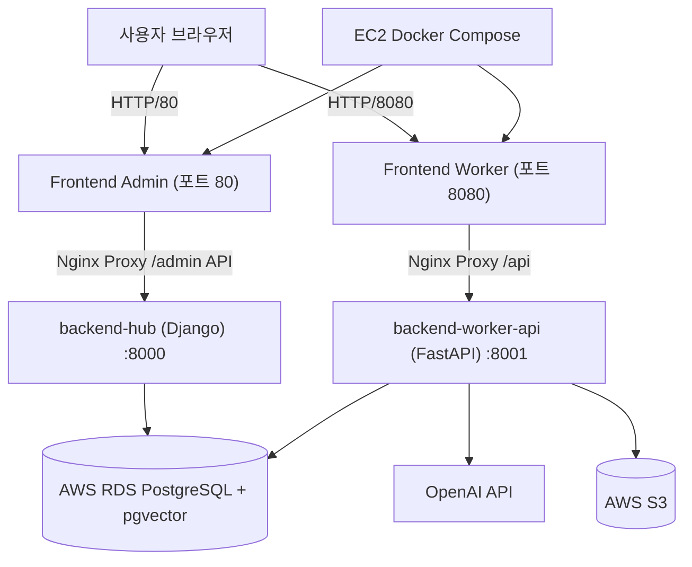

# AWS 아키텍처 (배포 가이드)

## 개요

이 프로젝트는 AWS EC2 위에서 Docker Compose로 운영되며, 프런트엔드(관리자/작업자)와 백엔드(Django, FastAPI)를 동일 네트워크에서 연결합니다.

- 프런트엔드(정적): `frontend_admin`, `frontend_worker` (Nginx 기반 정적 서빙)
- 백엔드 API:
  - Django (`backend-hub`) : `/api/v1/...` 일부 경로(관리자/통계/로그 등)
  - FastAPI (`backend-worker-api`) : `/api/...` 사용자 상담/엔지니어 호출/AI 라우트
- 데이터베이스: AWS RDS PostgreSQL (`pgvector` 사용)
- 객체 저장소: AWS S3

---

## 아키텍처 다이어그램



```text
아키텍처 (텍스트 폴백)
[사용자 브라우저] 
   ├─(80)→ [Frontend Admin :80] ─→ [backend-hub (Django):8000] ─→ [RDS PostgreSQL]
   └─(8080)→ [Frontend Worker :8080] ─→ [backend-worker-api (FastAPI):8001] ─→ [RDS PostgreSQL]
                                                            ├→ [OpenAI API]
                                                            └→ [AWS S3]
```

---

## 요청 경로 매핑

- 관리자 페이지
  - `80` 포트: `frontend-admin` 컨테이너가 페이지 제공
  - API 호출 예시: `/api/admin`, `/api/v1/dashboard`, `/api/v1/logs`, `/api/v1/admin-ai`, `/api/v1/rag`
  - 프록시 대상: `backend-hub`(Django, 8000) 또는 `backend-worker-api`(FastAPI, 8001)
- 작업자 페이지
  - `8080` 포트: `frontend-worker` 컨테이너가 페이지 제공
  - API 호출 예시: `/api/v1/consultations/*`, `/api/v1/consultations/stats`, `/api/v1/consultations/translate-text`
  - 프록시 대상: `backend-worker-api`(FastAPI, 8001)
- DB 연동
  - 두 백엔드 모두 `.env`의 PostgreSQL 설정으로 RDS 접속
- AI 처리
  - FastAPI Worker에서 OpenAI 호출 또는 자체 모델 모듈(`backend_ai`) 사용

---

## 배포 구성 요소

| 레이어 | 구성 | 역할 |
|---|---|---|
| 접속 계층 | EC2 보안그룹 | 포트(80, 8080, 22) 오픈 |
| 프런트엔드 계층 | `frontend-admin`, `frontend-worker` | 정적 번들 제공 + API 프록시 |
| API 계층 | `backend-hub`, `backend-worker-api` | Django 관리 API, FastAPI 작업자 API |
| 데이터 계층 | AWS RDS (PostgreSQL + pgvector) | 사용자/로그/세션/통계/벡터 데이터 |
| 저장소 계층 | AWS S3 | 첨부 파일/문서/파이프라인 산출물 |
| 외부 AI 계층 | OpenAI API | 번역/의사결정 모델 호출 |

---

## 운영 포인트

- 운영 기본 진입은 `docker-compose.prod.yml` 기준
- HTTPS 적용(권장): ALB 또는 Nginx reverse-proxy + 인증서 적용
- 데이터베이스 접속은 앱 시작 시 헬스체크/대기 로직으로 안정화
- 초기 기동 시 AI 로딩 지연을 고려해 컨테이너 재시작 정책과 healthcheck 간격 조정
